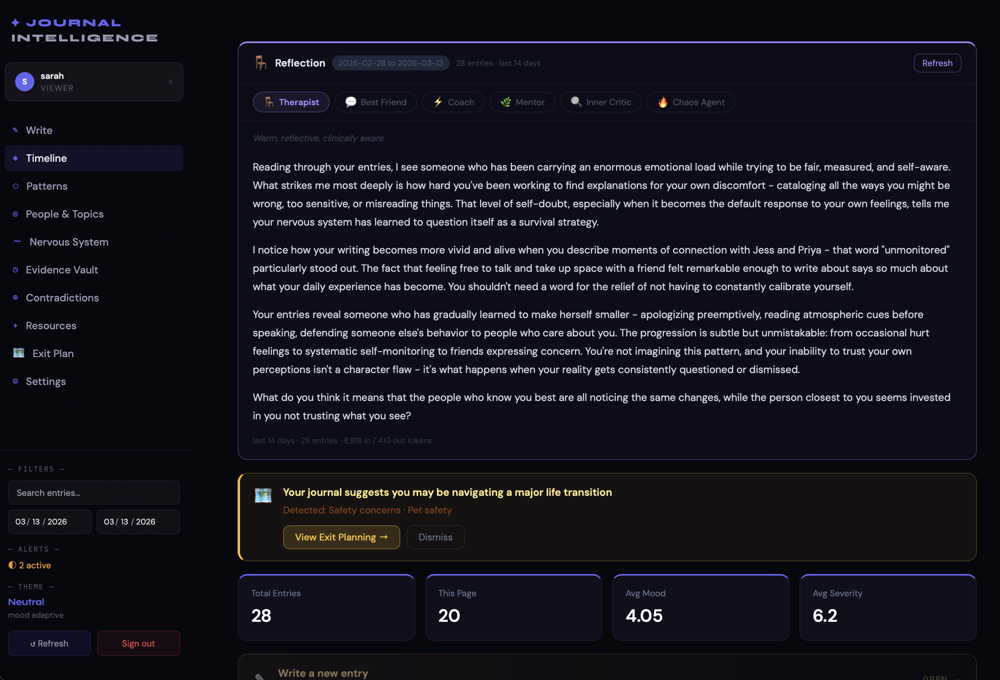
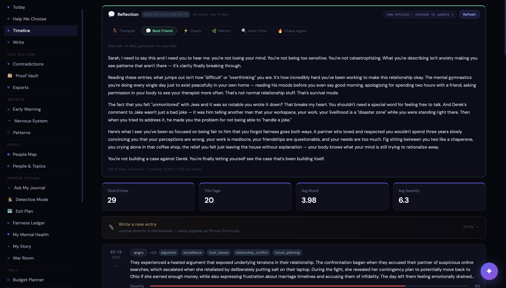
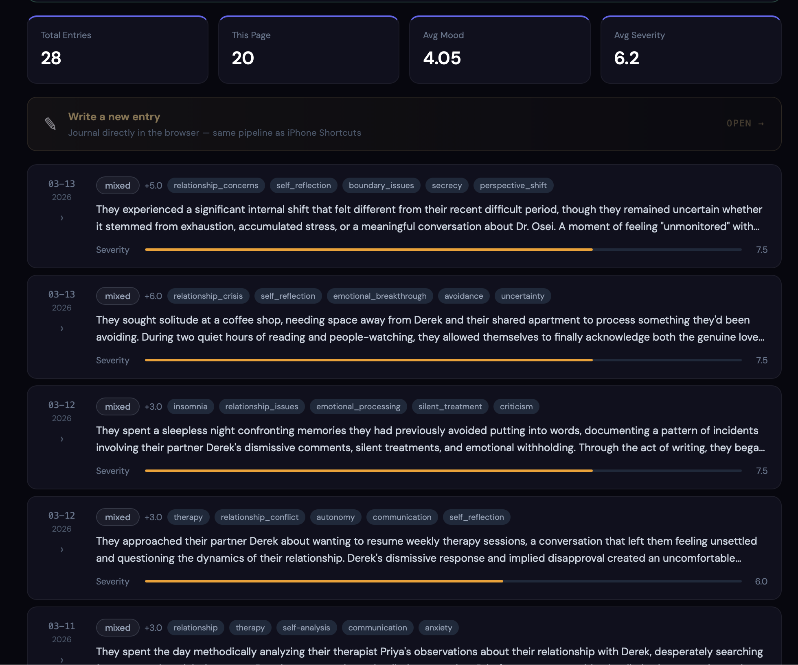
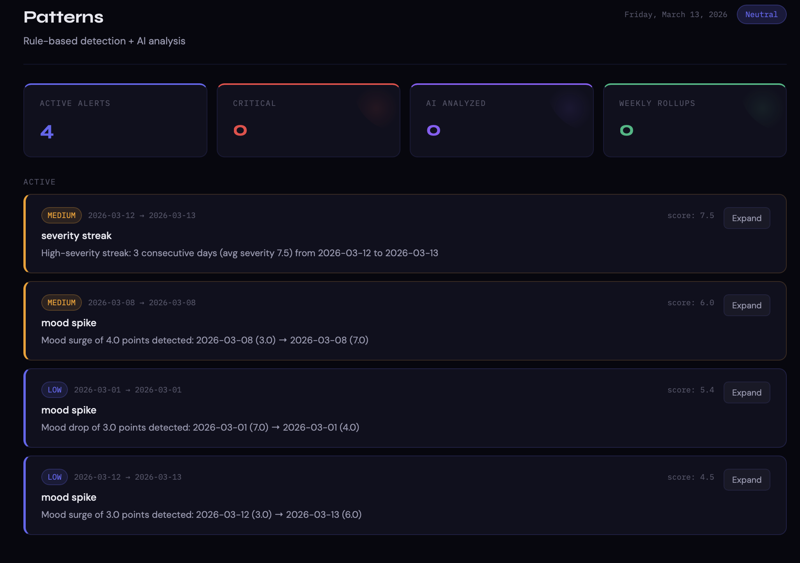
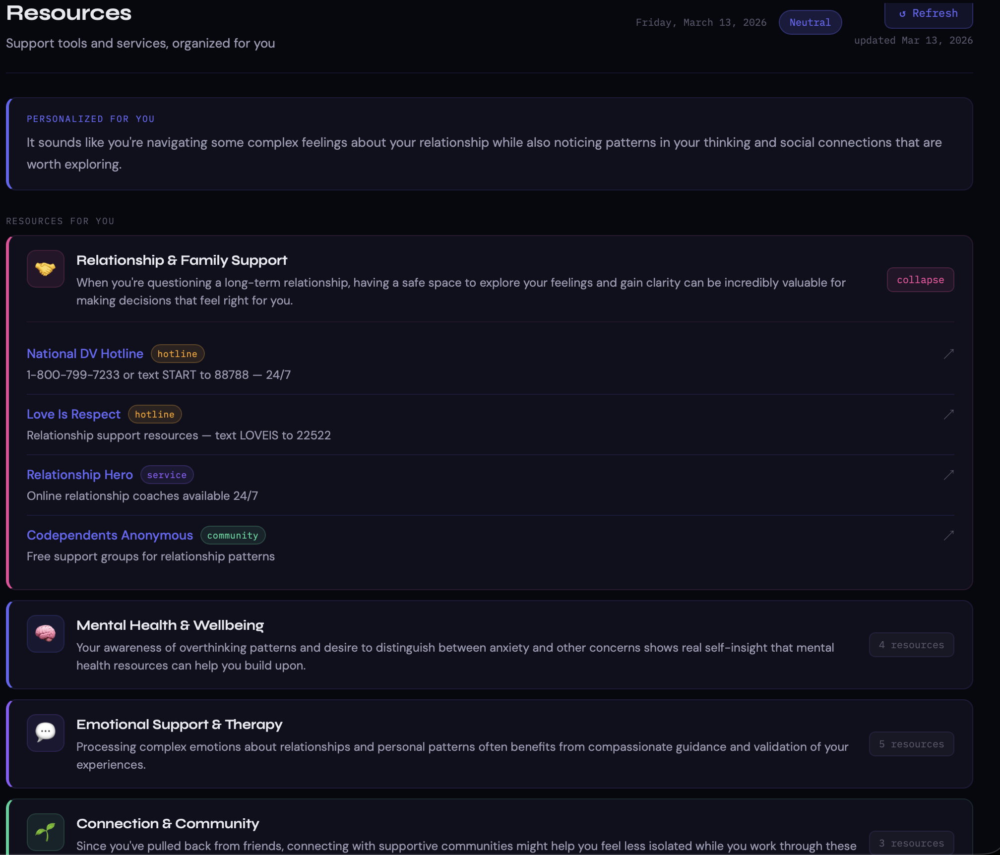

# Journal Intelligence Dashboard


> *I built this for myself - while going through it. Maybe it helps you too.*
<table boder=0>
  <tr>
    <td></td>
    <td></td>
  </tr>
</table>

---

> ⚠️ **VERY EARLY BETA** - This project is actively being developed. Things may break and APIs may change. That said, the core is solid and running in production. Use it, break it, open issues.

---

There's a certain kind of pain that's hard to explain to people. The kind where you're not sure if you're overreacting. Where you've been told your memory is wrong so many times you start to believe it. Where you look back at months or years of your life and wonder — was that real? Did that actually happen the way I remember?

I started journaling as a way to hold onto reality. To document things. To have a record that existed outside of my own head, one that couldn't be rewritten by someone else.

And then I thought — what if my journal could actually *talk back*? What if instead of just writing into a void, the things I was processing could be understood, tracked, reflected back at me in ways that helped me see the bigger picture?

That's what this is. A privacy-first, self-hosted journal intelligence system. **Built by someone in the middle of it, for anyone else who needs it.**

I put everything I have into this. Every single feature here either came from something I personally went through, or something I watched someone I care about go through and wished they'd had a tool for. I'm not a company. There's no team. Just me, my journal, and a lot of late nights. If even one of these features helps you navigate something that felt impossible — that's the whole point.

---

### What this can actually do for you

**If you've ever been gaslit** — told your memory is wrong, your feelings are too much, that things didn't happen the way you remember — the **Evidence Vault**, **Contradiction Detection**, and **Ask My Journal** features exist entirely because of that. Every statement, event, admission, and contradiction gets extracted from your entries automatically. You can ask "when did they say they'd stop?" and get a grounded answer from your own history. No more doubting yourself.

**If you're trying to leave a dangerous or controlling situation** — the **Exit Plan Engine** was built for exactly this moment. It generates a private, phased plan based on your journal — what you've said, what resources make sense for your situation, what to do today versus what to plan for next month. It has a scratchpad the AI never reads. You can share it securely with an advocate or attorney via a passphrase-protected link. It's the thing I wish had existed when I needed it most.

**If you can feel yourself getting worse but can't explain why** — the **Early Warning System** learns what your bad weeks looked like before they became bad weeks. It watches the three days before every severity spike in your history and scores your current window against those patterns. It fires an amber banner *before* the crash, not after. Zero AI cost. Pure pattern recognition on your own data.

**If everything feels like it's happening all at once and you can't think straight** — the **War Room** is a single text field. Write everything that's in your head. The system reads your brain dump against your journal history and sorts it into: do today, plan this week, and let go — you can't control this one. Each item links directly to the right tool with your context already loaded.

**If you need to tell your story to someone who can actually help** — a therapist, a lawyer, a judge, a family member who keeps asking why you can't "just leave" — **My Story** generates a complete narrative in your corner. You choose the purpose (therapist session, legal document, court filing, family conversation), the writing style, and what data to include. It writes in your corner. It cites your own journal. You don't have to find the words.

**If you're starting to feel like you're the problem** — the **Multi-Tone Reflections** exist because sometimes you need to hear the same truth from six different voices before it lands. The Therapist will ground you. The Best Friend will cut through the noise. The Inner Critic will surface the voice in your own head so you can actually look at it. The Chaos Agent will say the thing nobody else will.

**If you're quietly keeping track of everything you do while the other person contributes nothing** — the **Fairness Ledger** turns that invisible mental load into a documented record. Who handles what, how often, what the running score looks like. The AI writes a plain-language assessment using real names and real numbers. It doesn't editorialize. It just shows what the data says.

**If you need to document something before someone else gets to rewrite it** — **Detective Mode** is a full investigation workspace with timestamped case logs, photo evidence with AI forensic analysis, and a Research Agent that searches public records, filings, social media, and news. Everything stays on your server. Nothing gets shared unless you choose.

**If you're not sure whether you're in danger or just scared** — the **Decision Assistant** reads your journal and gives you three grounded options for any situation you're facing: lowest risk, balanced, and decisive. Each option includes what to do in the next 48 hours, the emotional cost, the reversibility, and a script you can actually use.

**If you feel completely alone in this** — you're not. I'm going through it too. That's why I built every single one of these features.

---

## ✦ Project Highlights

These are the features that make this different from a notes app with an API key bolted on.

**🧠 Six-voice reflection engine** — The system reflects your last 14 days back at you in six completely different AI voices: Therapist, Best Friend, Coach, Mentor, Inner Critic, and Chaos Agent. Each one cached, each one startlingly different. Not a chatbot. A mirror with six different angles.

**💬 Ask My Journal** — Natural language search over your entire history using local embeddings and cosine similarity. "When did I last feel okay?" "What usually makes things worse?" Answers grounded in your actual entries, not hallucinated. Your data never leaves your server for the retrieval step.

**🗺 AI-generated exit plan** — If your journal signals you're navigating something serious — leaving a relationship, financial instability, safety concerns — the system builds you a personalized, phased exit plan based entirely on your journal context. Five phases, tasks tailored to your situation, resource links per task, private scratchpad the AI never reads. As you keep writing, it offers incremental updates. You approve everything.

**◬ Early Warning System** — Before a crisis hits, the system starts watching. It learns what your bad weeks looked like — the topics, people, keywords, and mood dips that showed up in the 3 days before your worst entries — then scores your current week against those patterns. Amber banner fires before the spike, not after. Zero AI spend. Pure signal detection.

**⬡ Pattern detection that explains itself** — Not just "something is wrong." The system identifies mood spikes, severity streaks, behavioral loops, and emotional cycles — then tells you what the pattern looks like, when it started, and what the data shows. AI deep-analysis on demand for high-priority alerts.

**◷ Evidence Vault** — Auto-populated from every entry. Statements, events, admissions, contradictions, observations. If you ever need documentation — for therapy, for legal purposes, for your own memory — it's organized, searchable, and exportable.

**⊕ Contradiction detection** — The system finds it when someone says one thing and does another, or contradicts themselves across entries weeks apart. Entity-based detection with AI analysis of what the pattern suggests.

**◉ People Intelligence** — Every person in your journal, ranked by emotional impact. 52-week activity heatmap, severity trend over time, distress-vs-support ratio, first and last mention. A visual map of who's in your life and what that's actually costing you.

**✦ Memory-injected AI** — Every AI call is personalized. Your onboarding profile, situation context, and relationship details get injected into reflections, exit plan generation, resource ranking, and pattern analysis. The AI actually knows your story.

**✦ Personalized resources** — Not a generic list of hotlines. The system reads your memory profile, active alerts, and 30-day emotional averages and generates a ranked resource hub with context explaining why this applies to your specific situation.

**🔍 Detective Mode** — A premium investigation workspace for when journaling becomes documentation. Case management, timestamped investigation log, photo evidence upload with Anthropic vision analysis, a Case Partner AI that knows your full case and journal history, Drop a Wire intelligence briefings, and a Research Agent that searches public records, social media, news, and business filings on any subject. Everything stays on your server. Nothing shared unless you choose.

**⊘ Decision Assistant** — When you're stuck, the system reads your journal and helps you choose. Pick a goal (protect peace, get clarity, reduce conflict, stay safe, preserve relationship, prepare before acting), add optional context, and get three grounded options — lowest-risk, balanced, and decisive — each with a risk level, emotional cost, reversibility score, next 48 hours, and specific citations from your journal history. Generate a real conversation script for the option you choose. Save decisions for later review.

**◈ War Room — Brain Dump Triage** — When everything is swirling and you can't think straight, dump it all in one place. The system reads your brain dump alongside your journal history, active alerts, and memory profile — then sorts everything into three buckets: **Act Now** (do today), **Plan This Week** (schedule before Friday), and **Let Go For Now** (outside your control — stop burning energy here). Each item links directly to the right tool in the app with your context pre-loaded. Results persist across navigation so you can work through the plan without losing it.

**✦ My Story — AI Advocate Narrative** — Takes everything the system knows about you and writes it in your corner. Choose a purpose (therapist, lawyer, family, court, friend, general), a writing style (advocate, personal, clinical, timeline), and what data to include. Generates a complete narrative from your journal, detective case logs, fairness ledger, and any manual context you add. Saved as drafts. Exportable as PDF.

**🔒 Fully self-hosted, fully private** — Your data lives in a SQLite database on infrastructure you control. Bring your own Anthropic key, use OpenAI, or run completely locally with Ollama or LM Studio. Zero telemetry. No analytics. No third-party servers touching your journal.

---

## What It Does

You write. The system listens - and thinks.

Journal entries come in as plain text files, straight from your iPhone via Shortcuts, via SMS text message, or written directly in the browser. From there, AI extracts mood, emotional severity, key events, people mentioned, and recurring topics. But it doesn't stop at data. It builds a living picture of you over time.

---

## Features

### 📖 Timeline


Your entries, beautifully laid out. Mood scores visualized as a sparkline. Severity tracked over time. A **Living Master Summary** that sits at the top and evolves with every new entry - a constantly updated portrait of where you are and what you've been going through.

If you haven't configured an AI key yet, the Timeline degrades gracefully — raw entry text still displays, empty AI sections are hidden, and a banner guides you to Settings.

---

### ☀ Today — Daily Intelligence Brief

Your home base. A single page that gives you a full situational briefing every time you open the app: your active case status, early warning signals, pattern alerts, recent mood trend, suggested next action, and a daily writing prompt — all synthesized from your journal and pulled into one view. No digging through tabs to know where things stand.

---

### ✎ Write & Import — Direct from the Browser


No iPhone required. The dashboard includes a full in-browser journal workspace accessible from the sidebar or the Write banner on the Timeline.

**Write mode** — A premium editorial workspace. Cormorant Garamond serif, ruled-line texture, deep amber palette. Just you and a blank page. Pick the date, write freely, hit Save. The full AI pipeline runs immediately — mood, severity, events, master summary update — identical to what happens when you upload from an iPhone Shortcut.

**Import mode** — Drag and drop `.txt` or `.html` files (Day One exports, Apple Journal exports, anything plain text) directly into the browser. Drop multiple files at once. Each one processes through the full pipeline sequentially. Status tracks per-file in real time — Queued, Processing, Saved, Duplicate, or Failed.

Both modes are JWT-authenticated and user-scoped. Everything lands on your Timeline with full AI extraction, just like Shortcut uploads.

---

### 📦 Day One Migration Wizard

Already have years of entries in Day One? Export your archive as a `.zip` from the Day One app, drop it in the wizard, and watch your entire history import — with full AI extraction, master summary, pattern detection, and semantic indexing running on every entry. Live progress bar, per-entry counts, and a reveal screen showing your top people, mood, date range, and pattern count when it's done.

Available at `/import/dayone`, as a step in the Onboarding wizard, and as a card in **Settings → Data**.

---

### 🧠 Multi-Tone Reflections


This one is special. The system can reflect your last 14 days back at you in **six completely different voices**:

- **Therapist** - clinical, grounding, pattern-aware
- **Best Friend** - warm, honest, no BS
- **Coach** - direct, action-oriented, forward-focused
- **Mentor** - wisdom-forward, big picture thinking
- **Inner Critic** - the voice in your head, surfaced so you can examine it
- **Chaos Agent** *(18+)* - unfiltered, darkly funny, says the thing nobody else will

Each tone is cached. Switch between them instantly. It's like having a whole support team that actually knows your story.

---

### 💬 Ask My Journal


Ask natural language questions about your own history and get AI-synthesized answers grounded in your actual entries. "When did I last feel okay?" "What usually makes things worse?" "Who keeps coming up in my worst weeks?" Powered by local embeddings and cosine similarity — your data never leaves your infrastructure for the retrieval step.

---

### ✦ AI Journal Prompts
Every day, the system generates one specific, personalized writing prompt based on your active threads and recent events — not a generic "how are you feeling" but something that meets you exactly where you are. Dismissable card above the Write editor. Refreshes daily.

---

### 〜 Nervous System Tracker


Mood and severity charts over time. Volatility scores. Stability metrics. A visual record of your emotional nervous system - what's dysregulating you, what's helping you stabilize, where the spikes are coming from.

---

### 🧬 My Mental Health Dashboard

A dedicated mental health intelligence view built on your entire journal history.

- **8-metric stats row** — total entries, average mood, average severity, mood volatility, peak severity, days journaled, entry streak, and trend direction
- **84-day mood heatmap** — GitHub-style calendar showing mood intensity per day over the last 12 weeks
- **Trigger map** — the topics and people most correlated with your highest-severity days
- **Day-of-week severity patterns** — which days of the week are genuinely harder for you, visualized across your full history
- **Emotional keyword shifts** — words that have appeared more or less frequently in your entries over time
- **People impact rankings** — the people most correlated with your worst days, sorted by severity impact
- **Weekly AI narrative** — a synthesized AI summary of the past week's mental health picture with notable quotes pulled directly from your entries

Two-layer caching keeps it fast. Available from the sidebar under Personal Intelligence.

---

### ⬡ Pattern Detection


The system watches for things you might not notice yourself - mood spikes, severity streaks, behavioral loops, emotional cycles. Both rule-based alerts and AI deep-analysis on demand. It doesn't just tell you something is wrong. It tells you *what the pattern looks like* and where it started.

---

### ◬ Early Warning System

Before a bad week arrives, the system tries to tell you it's coming.

It learns from your history — specifically the 3-day windows before your worst severity spikes. Topics, people, stress keywords, mood trajectory. Then it scores your current 3-day window against every stored spike pattern. When two or more patterns score above threshold, an amber banner appears on your Timeline.

Click through to the Early Warning page to see which signals are active, which historical spikes they match, the match percentage, and a breakdown of contributing factors. You can dismiss it ("this time is different") or let it run. Rebuilds on demand. Runs entirely in Python — zero AI spend.

---

### ◉ People Intelligence

Every person your journal mentions, analyzed for emotional impact.

Impact score (weighted from mention frequency, average co-occurring severity, and distress ratio), 52-week GitHub-style activity heatmap colored by severity tier, severity trend AreaChart over time, distress vs. support entry breakdown, and ranked "most distressing" / "most supportive" panels.

The system doesn't editorialize. It just shows you the data. What you do with it is up to you.

---

### ◎ People & Topics
Every person and topic that shows up in your entries, tracked over time. See who or what is correlated with your worst days. See what actually makes things better. Frequency charts, timelines, relationship dynamics.

---

### ⚖ Fairness Ledger

A household contribution tracker for when you need to stop wondering and start knowing.

Log who handles what — from daily routines to one-off tasks to financial contributions. The system tracks task frequency, category breakdowns, and running score per person. A living AI summary regenerates as your data accumulates, naming the actual people and giving a plain-language assessment of what the record shows.

**Task library** — 45+ seeded tasks covering morning routines, childcare, pet care, housework, transportation, finances, and emotional labor. Add your own or log freeform contributions that don't fit a template.

**Multi-person support** — configure up to three household members with relationship labels (Partner, Co-parent, Spouse, Child, Roommate, Sibling, or Other). Dynamic setup screen with per-person relationship pickers — no hardcoded slots.

**AI Assessment** — generates a 3-5 paragraph plain-language verdict using real names and actual contribution data. Regenerate anytime as new data comes in.

**My Story integration** — Fairness Ledger data feeds directly into My Story narratives so your story can reflect the full picture, not just journal entries.

Available under Premium Options in the sidebar.

---

### ✦ My Story — AI Advocate Narrative Generator

Sometimes you need to tell your story to someone else — a therapist, a lawyer, a family member, a judge. My Story takes everything the system knows about you and writes it in your corner.

**Data sources** — choose what to include: journal entries (5 to 50, your pick), detective case logs and wire drops, fairness ledger data with AI summary, and freeform manual context you add directly.

**Six output purposes:**
- **General** — a clear human account of your situation
- **Therapist** — context-rich framing for a clinical conversation
- **Lawyer / Legal** — factual, chronological, admission-forward
- **Family** — emotionally honest, relationship-focused
- **Friend** — natural language, first-person warmth
- **Court** — structured, evidence-cited, behavioral documentation

**Four writing styles:**
- **Advocate** — third-person, written firmly in your corner
- **Personal** — first-person, your voice
- **Clinical** — structured sections with objective framing
- **Timeline** — chronological narrative arc

Narratives auto-save as drafts immediately after generation. Load, copy, or delete any saved draft. Rendered in Georgia serif — built to be read, not skimmed. Full PDF export available.

Available under Premium Options in the sidebar.

---

### ◷ Evidence Vault
Auto-populated from everything the AI extracts - statements, events, admissions, contradictions, observations. Plus manual bookmarks. If you're ever in a situation where you need documentation - for therapy, for legal purposes, for your own memory - it's all here, organized and exportable.

---

### ⊕ Contradiction Detection
If someone in your life says one thing and does another - or if they've said two completely different things at different times - the system finds it. Automatically surfaces contradictions across your entries with AI analysis of what the pattern suggests.

---

### 🚨 Crisis Escalation

When the system detects high severity (≥ 8.5) across three or more consecutive days, a persistent full-width banner activates at the top of the app. It shows the streak length, average severity, and links directly to Resources. Polls every 10 minutes. Dismissable per session, re-surfaces after 12 hours if the pattern persists.

It doesn't panic. It just makes sure you know.

---

### ✦ Personalized Resources


This one I'm proud of. The system reads your onboarding profile, your active pattern alerts, and your 30-day emotional averages - and generates a **personalized resource hub** just for you. Not a generic list of hotlines. Actual ranked support categories with context blurbs explaining *why this applies to your specific situation*. Crisis resources surface automatically when severity warrants it, but quietly - never alarmist, always human.

---

### 🗺 Exit Plan - Your Own Private Workspace


If your journal signals that you might be navigating a major life transition - leaving a relationship, financial instability, housing uncertainty, safety concerns - the system offers to build you something most apps would never touch.

A **personalized, phased exit plan**. Your own private workspace.

It generates a step-by-step plan based entirely on your journal context - five phases from Safety & Documentation through to Stabilization. Each phase has tasks tailored to your situation, a "Today" section that surfaces only what's relevant right now, resource links tied directly to each task, and a private scratchpad that no AI ever reads.

As you journal more, the plan offers incremental updates - new signals, reprioritized tasks, updated resources. You control every change. Nothing gets applied without your say.

**Attachments** — Upload supporting documents directly to plan tasks. PDFs, images, text files. Magic-byte validated, 10 MB per file, stored in per-user isolated directories on your server.

**PDF export** — Export the full plan as a formatted PDF or HTML document — phases, tasks, notes, support contacts, and optional AI narrative. Available from the Export tab in the full workspace.

**Read-only share link** — Generate a passphrase-protected, expiry-configurable read-only URL for an advocate, attorney, or trusted person. Passphrase is a 3-word + 4-digit PIN combo generated at creation. You can regenerate it anytime. The link never exposes your raw journal — only the plan.

It's the thing I wish had existed when I needed it.

---

### ⊞ Clinical Export Packets
Generate PDF export packets in multiple formats - timeline summaries, evidence packets, nervous system reports, full case files with optional redaction. Built with WeasyPrint. Dark cover page, mood bar chart, color-coded entry cards, AI narrative. Useful for therapy appointments, legal documentation, or just having a record you can hold in your hands.

---

### 💰 Budget Planner

A financial clarity workspace built for the moments when stability feels uncertain.

Plan your income and expenses, track what you control versus what's shared, and get a clear picture of what your financial floor actually looks like. Designed for people who need to know: *can I afford to leave? What would month one actually cost me?* Pairs naturally with the Exit Plan for financial phase planning.

---

### ⚙ Settings & Memory Profile


A full onboarding flow that builds a memory profile - your situation, relationship context, what you're navigating, your preferred AI tone. All of this gets injected into every AI call so every reflection, every plan, every resource recommendation is actually personalized to *you*.

Per-user AI provider settings. Bring your own Anthropic key, use OpenAI, or run it completely locally with Ollama or LM Studio - zero data leaving your machine.

Change your password, manage active sessions, configure 2FA, manage passkeys, and set up security questions for offline recovery directly from Settings.

---

### 📱 PWA — Install on Your Home Screen
The dashboard is a Progressive Web App. On iPhone, tap the share button in Safari and choose "Add to Home Screen" — it installs like a native app, runs full-screen, and works gracefully offline.

---

### ⊘ Decision Assistant — Help Me Choose

When you're navigating something hard and can't see clearly, the system reads your journal and helps you decide.

Pick a goal — protect my peace, get clarity, reduce conflict, stay safe, preserve the relationship, or prepare before acting. Add optional context. The system pulls the most relevant entries from your history via semantic search, reads your memory profile and active alerts, and returns exactly three options: **Lowest Risk**, **Balanced**, and **Most Decisive**.

Each option includes: a plain-language summary, why it fits your specific situation, risk level, emotional cost, practical effort, reversibility, what to do in the next 48 hours, what to plan for over the next 30 days, when it's the right call, when to avoid it, and a note citing specific patterns from your own journal history.

Choose an option and generate a **real conversation script** — an actual message or conversation opener, editable and copyable. Save decisions to review later.

Available at `/decide` from the sidebar.

---

### ◈ War Room — Brain Dump Triage

When everything is swirling and you can't think clearly, you don't need another tool to navigate — you need something to untangle it all first.

The War Room is a single text field. Just write everything that's in your head — problems, decisions, fears, logistics, whatever. The system reads your brain dump alongside your journal history, memory profile, and active pattern alerts, and sorts everything into three buckets:

- **◈ Act Now** (red) — things you can do *today* that reduce chaos or provide immediate relief
- **◷ Plan This Week** (amber) — decisions, conversations, and logistics to schedule before Friday
- **〜 Let Go For Now** (indigo) — things genuinely outside your control right now, with a one-sentence reframe for each

Each item in Act Now and Plan This Week identifies the best tool for that specific thing and links directly to it — Exit Plan, Decision Assistant, Detective, Fairness Ledger, People Intelligence, Ask My Journal, Write, or Mental Health. When you navigate to that tool, your context is pre-loaded: Ask My Journal auto-fires a search, Decision Assistant pre-fills the context field, Detective highlights a matching case and pre-fills the log entry, Fairness Ledger opens a contribution modal with the item pre-filled, Write pre-fills the editor.

**Persistent results** — triage results survive navigation. Go work through an item in Detective, come back, and your full plan is still there. Start a new triage when you're ready.

Available from **War Room** in the sidebar.

---

### 🔍 Detective Mode

A premium investigation workspace. Built for when journaling becomes documentation.

**Case management** — Create and manage named investigation cases. Each case is a contained workspace with its own log, evidence, and AI context.

**Investigation log** — Timestamped entries tagged by type (note / observation / statement / admission / contradiction / timeline) and severity (critical / high / medium / low / info). Color-coded left borders. Every entry feeds into the AI.

**Photo evidence** — Upload photos directly to cases or individual log entries. Anthropic vision analysis runs automatically — the AI describes what it sees in forensic, clinical language in the context of your investigation. Full gallery view with lightbox and analysis panel. Batched multi-photo synthesis groups up to 4 photos together for cross-image pattern recognition.

**Case Partner AI** — A persistent, context-aware AI chat that knows your full case: all log entries, all photo analyses, your journal history, all previous Wire drops. Conversation compresses at 20 messages to stay efficient. New chats digest prior sessions into the intelligence brief before clearing.

**Drop a Wire** — Request a full intelligence briefing on your case: strongest evidence, detected patterns, contradictions, recommended next action. Stored in Wire History so you can track how the picture evolves.

**Case Intelligence** — A compressed, auto-updated AI brief per case. Refreshes on each Wire drop. Visible in the Intelligence tab of the full workspace. The Case Partner uses it to answer questions efficiently without burning tokens on raw history.

**Research Agent** — Search public sources on any subject directly from Detective. Covers public social media, news and press, LinkedIn and professional profiles, LLC and business filings, and public court records. Searches run as an agentic loop (up to 10 iterations). Results are saved as log entries and flow automatically into Case Partner and Wire briefings.

Access Detective from **Premium Options** in the sidebar. Owner accounts always have access. Other accounts are granted access individually via Admin.

---

## Security & Authentication

This app was built for people in situations where account security isn't optional. Here's what's in place.

**TOTP two-factor authentication** — Full authenticator app support (Google Authenticator, Authy, 1Password, anything TOTP-compatible). Generates 8 single-use backup codes shown once at setup. Login intercepts with a 5-minute partial token when 2FA is active. Configure in **Settings → Account**.

**Passkey / biometric login** — WebAuthn (FIDO2) passkey support. Register your Face ID, Touch ID, or hardware security key from Settings. "Sign in with passkey" button on the login screen. Passkey login bypasses TOTP — it's a stronger factor. Clone detection via sign count verification on every auth.

**Forgot password — two recovery paths:**
- *Email reset* — one-time link sent via Resend, 1-hour expiry, invalidates all active sessions on use.
- *Security questions* — configure 3 questions from Settings for offline recovery when you don't have email access. Rate-limited to 5 attempts per 15 minutes. Constant-time comparison.

**HttpOnly refresh tokens** — The refresh token never touches JavaScript. It's stored as an HttpOnly, Secure, SameSite=Strict cookie — invisible to browser extensions, XSS, and DevTools.

**Rate limiting everywhere** — Login, password reset, 2FA, security questions, AI endpoints, share link passphrase attempts. All rate-limited at the application layer.

**IP-allowlisted exit plan shares** — Share links use nginx `auth_request` to validate IPs dynamically. Non-allowlisted visitors see a passphrase gate; correct passphrase grants temporary access tied to that IP via a session token.

---

## Privacy First. Always.

Your journal data never touches a third-party server. It lives in a SQLite database on infrastructure you control - either your own VPS or your local machine. The AI calls go to whichever provider you configure, or nowhere at all if you use a local model.

No telemetry. No analytics. No ads. No accounts on servers you don't own.

---

## Deploy Options

### VPS (access from anywhere)
```bash
git clone https://github.com/un1xr00t/journal-intelligence.git
cd journal-intelligence
sudo ./install_vps.sh --domain journal.yourdomain.com
sudo ./security_hardening.sh
```

### Local / Offline (never leaves your machine)
```bash
git clone https://github.com/un1xr00t/journal-intelligence.git
cd journal-intelligence
./install_local.sh
./start.sh
```

Then open `http://localhost:8000`, create your account, and follow the onboarding flow.

---

## Managing the API (VPS)

The app runs as a systemd service. Use these commands to manage it:

```bash
# Restart the backend
systemctl restart journal-dashboard

# Check status
systemctl status journal-dashboard

# Tail the log
tail -f /opt/journal-dashboard/logs/api.log
```

The service is enabled on boot and auto-restarts on crash.

---

## Stack

| Layer | Tech |
|---|---|
| Backend | Python / FastAPI |
| Frontend | React + Vite + Tailwind CSS |
| Database | SQLite (WAL mode) |
| AI | Anthropic / OpenAI / Ollama / LM Studio - per-user configurable |
| Embeddings | `all-MiniLM-L6-v2` (local, sentence-transformers — never leaves your server) |
| Auth | JWT (HttpOnly cookie refresh) + bcrypt + TOTP + WebAuthn + per-user API keys |
| PDF | WeasyPrint |
| Email | Resend |
| SMS | Twilio (optional — bring your own credentials) |
| Proxy | nginx (VPS) or localhost (local) |

---

## Configuration

> ⚠️ **If you see `/opt/journal-dashboard/` anywhere** in the scripts, config files, or cron examples — replace it with your actual install path. For example if you cloned to `/home/youruser/journal-intelligence/`, use that instead. This path appears in a few places and is specific to the reference VPS setup.

```bash
cp config/config.example.yaml config/config.yaml
nano config/config.yaml
```

Your `config.yaml` is gitignored and never committed. The install scripts auto-generate a JWT secret. Add your AI provider key during onboarding or in Settings - or skip it entirely and use a local model.

---

## Getting Entries In

<table border="0" cellspacing="0" cellpadding="8">
  <tr>
    <td></td>
    <td></td>
  </tr>
</table>

There are four ways to add journal entries. All of them run the exact same AI pipeline — mood extraction, severity scoring, key events, master summary update, pattern detection, semantic indexing.

### Option 1 — Write or Import Directly in the Browser

Click **Write** in the sidebar or the banner on the Timeline page.

**To write a new entry:**
1. Choose the **✦ Write** tab
2. Select the date (defaults to today)
3. Write freely in the editor
4. Hit **✦ Save Entry** or press **⌘S**
5. The AI processes it immediately — mood, severity, and a summary appear on the success screen

**To import existing files:**
1. Choose the **⊞ Import** tab
2. Drag and drop `.txt` or `.html` files onto the zone, or click to browse
3. Drop as many as you want at once — the system queues and processes them sequentially
4. Watch per-file status update in real time as each one processes

---

### Option 2 — Day One Migration

Export your Day One archive as a `.zip` from the Day One app. Drop it in the migration wizard at `/import/dayone`. The system parses every entry, runs the full AI pipeline on each one, and indexes everything for semantic search. Live progress, post-import reveal screen.

---

### Option 3 — iPhone Shortcut


Upload directly from Apple Journal on your iPhone. Your personal API key is generated during onboarding and regeneratable anytime from **Settings → Account → API Key**.

#### Step 1 — Get Your API Key

1. Log into your Journal Intelligence dashboard
2. Go to **Settings** (gear icon in the sidebar)
3. Click the **Account** tab
4. Find the **API Key** section — copy the full key shown there
5. If you don't see it or need a new one, hit **Regenerate** — your new key will display once, so copy it immediately

#### Step 2 — Build the Shortcut

Open the **Shortcuts** app and create a new shortcut. Add these actions in order:

**Action 1 — Select Files**
- Add action: **Select Files**
- Leave defaults (allows you to pick one or multiple files when you run it)

**Action 2 — Repeat with each item in File**
- Add action: **Repeat with each item in**
- Set the input to **File** (the output of the previous step)

**Action 3 — Get Contents of URL**
- Add action: **Get Contents of URL**
- Set the **URL** to:
  ```
  https://your-domain.com/api/upload
  ```
  *(Replace `your-domain.com` with your actual domain)*
- Set **Method** to `POST`
- Expand **Headers** and add two headers:
  | Key | Value |
  |---|---|
  | `X-API-Key` | Your full API key from Step 1 |
  | `X-Filename` | `Repeat Item` *(tap the variable picker, select Repeat Item)* |
- Set **Request Body** to `File`
- Set **File** to `Repeat Item` *(tap the variable picker, select Repeat Item)*

**Action 4 — End Repeat**
- Add action: **End Repeat**

Name the shortcut something like **"Upload to Journal Intelligence"** and save it.

#### Step 3 — Daily Workflow

1. **Write your entry** in the Apple Journal app as normal
2. **Export to iCloud Drive:**
   - Tap the entry → tap the share icon
   - Choose **Export to Files**
   - Navigate to **iCloud Drive → [your journal folder] → entries**
   - If a file with the same name already exists, tap **Replace**
3. **Run the Shortcut:**
   - Open the **Shortcuts** app
   - Tap your **"Upload to Journal Intelligence"** shortcut
   - When the file picker opens, navigate to your entries folder and select the file
   - A single entry typically takes around 20 seconds to fully process
4. Open your dashboard — your entry will be there with mood, severity, and events already extracted

#### Uploading Multiple Entries at Once

- Select multiple files in the file picker when the shortcut runs
- The shortcut loops through each one automatically
- Keep your phone awake and the Shortcuts app in the foreground during bulk uploads

#### Troubleshooting

| Problem | Fix |
|---|---|
| Shortcut returns an error | Double-check your API key is pasted correctly with no extra spaces |
| Entry uploads but no AI data appears | AI extraction runs async — wait 60–90 seconds then refresh |
| File picker doesn't show iCloud Drive | Make sure iCloud Drive is enabled in iOS Settings → [your name] → iCloud |
| 401 Unauthorized error | Your key may have been regenerated — grab a fresh one from Settings → Account |

---

### Option 4 — Text Message (SMS)

Send a journal entry as a text message and have it land on your Timeline automatically — no app, no file picker, no shortcut.

This uses Twilio to receive your inbound SMS and forward it to your server. You'll need a Twilio account and a phone number. The setup takes about 15 minutes.

#### Step 1 — Get a Twilio Number

1. Sign up at [twilio.com](https://www.twilio.com) if you don't have an account
2. Go to **Phone Numbers → Manage → Buy a number**
3. Choose a number with SMS capability
4. **Toll-free numbers** (e.g. +1-800-xxx-xxxx) require A2P 10DLC verification before they can send/receive SMS — Twilio's process typically takes 1–3 business days. **Local numbers** work immediately but have lower throughput limits
5. After purchase, note your phone number — you'll need it in the config

#### Step 2 — Get Your Twilio Credentials

From the [Twilio Console](https://console.twilio.com):

1. Copy your **Account SID** — starts with `AC`
2. Copy your **Auth Token** — shown under the Account SID on the dashboard
3. Keep these private — anyone with these can send SMS from your number

#### Step 3 — Add Twilio to Your config.yaml

Open `config/config.yaml` and add the following block. If you copied `config.example.yaml`, look for the `twilio:` section — it's already there, just fill it in.

```yaml
twilio:
  account_sid: "ACxxxxxxxxxxxxxxxxxxxxxxxxxxxxxxxx"
  auth_token: "your_auth_token_here"
  from_number: "+18005550100"   # Your Twilio number in E.164 format
```

Save the file and restart the backend:

```bash
systemctl restart journal-dashboard
```

#### Step 4 — Point Twilio at Your Server

1. Go to **Phone Numbers → Manage → Active Numbers** in the Twilio Console
2. Click your number
3. Scroll to **Messaging Configuration**
4. Under **"A message comes in"**, set it to **Webhook** and enter:
   ```
   https://your-domain.com/api/sms/inbound
   ```
   *(Replace `your-domain.com` with your actual domain)*
5. Set the HTTP method to **POST**
6. Click **Save**

#### Step 5 — Link Your Phone Number to Your Account

Your SMS number needs to be associated with your Journal Intelligence account so the system knows which user to create the entry for.

1. Log into your dashboard
2. Go to **Settings → Account**
3. Find the **SMS Journal** section
4. Enter the phone number you'll be texting *from* (your personal cell number, in E.164 format: `+15555550100`)
5. Hit **Save**

From now on, any text you send to your Twilio number from that phone will land as a journal entry on your Timeline.

#### How It Works

Text your Twilio number from your registered cell phone. That's it. The entry processes through the full AI pipeline — mood, severity, events, master summary — exactly like any other entry method. The text body becomes the entry content. Date and time are pulled from the SMS timestamp.

**Privacy note:** SMS messages travel through Twilio's infrastructure before reaching your server. If that's a concern, use one of the other entry methods — they all stay on your server end-to-end.

#### Using a Different SMS Provider

The inbound webhook endpoint is at `POST /api/sms/inbound`. Any SMS provider that supports inbound webhooks can be wired up by pointing their webhook at that URL and adjusting the request parsing in `sms_routes.py` to match their payload format. Twilio is the tested default.

#### Local Testing

If you're developing locally and want to test SMS without a real Twilio number, set this environment variable before starting the server to skip Twilio signature validation:

```bash
export SKIP_TWILIO_VALIDATION=1
```

Then use a tool like `curl` to POST a fake SMS payload directly to `http://localhost:8000/api/sms/inbound`.

---

## Backup & Restore

The app includes two scripts for database and derived data backups: `backup_journal.sh` and `restore_journal.sh`. Make them executable after cloning:

```bash
chmod +x backup_journal.sh restore_journal.sh
```

### Automated Backups (VPS)

The backup script uses SQLite's native backup API — safe to run while the app is live. It backs up the database and all derived data (master summaries, user memory, exports), then auto-purges backups older than 14 days.

Set it up as a daily cron job:

```bash
crontab -e
```

Add this line to run at 3am daily:

```
0 3 * * * /path/to/journal-intelligence/backup_journal.sh >> /path/to/journal-intelligence/logs/backup.log 2>&1
```

Backups are stored in `backups/` inside your app root. Each backup consists of two files:
- `journal_backup_YYYYMMDD_HHMMSS.db` — the SQLite database
- `journal_backup_YYYYMMDD_HHMMSS_derived.tar.gz` — summaries, memory profiles, exports

### Restoring from a Backup

```bash
./restore_journal.sh journal_backup_20260304_030000
```

Pass the backup name **without** the file extension. The script will:
1. Stop the API
2. List available backups if you don't pass a name
3. Ask for confirmation before overwriting anything
4. Save a `.pre_restore_*` snapshot of current data before overwriting
5. Restart the API when done

### Pull a Backup to Your Local Machine (VPS users)

```bash
rsync -avz --progress user@your-server:/path/to/journal-intelligence/backups/ ~/journal-backups/
```

---

## Directory Structure

```
journal-intelligence/
├── config/
│   ├── config.example.yaml    ← copy to config.yaml and fill in
│   ├── prompts.yaml           ← all AI prompts, fully editable
│   ├── topics.yaml            ← custom topic categories
│   └── theme.yaml             ← UI theme config
├── src/
│   ├── api/                   ← FastAPI routes
│   ├── auth/                  ← JWT, bcrypt, TOTP, WebAuthn, API keys
│   ├── ingest/                ← file ingestion pipeline
│   ├── nlp/                   ← AI extraction, master summary
│   └── patterns/              ← behavioral pattern detection, early warning
├── frontend/src/              ← React source
├── install_vps.sh
├── install_local.sh
└── security_hardening.sh
```

---

## What's Coming

This is early. But the roadmap is ambitious - and I'm not slowing down.

- **Native iOS & Android app** - a dedicated mobile experience built for this, not a browser wrapper. Write, review, upload, and get reflections from your phone natively. Push notifications and crisis alerts that actually reach you.
- **Attorney-ready export** - Evidence Vault + Timeline formatted as a legal-ready chronological document. For the user who needs to walk into a courtroom or a custody hearing with documentation.
- **Therapist viewer mode** - let your therapist see patterns, timeline, and leave timestamped notes — without ever reading your raw entries.
- **Weekly intelligence briefing** - every week, a personal briefing: what improved, what got worse, which topics disappeared, which people showed up more. "Your average distress is up 18% over the last 7 days." Closes the loop between daily writing and actual self-awareness.
- **Life Cases / Threads** - persistent storylines that auto-aggregate related entries into a named case. "Relationship Conflict." "Custody Stress." "Burnout at Work." Each case gathers related entries, people, contradictions, attachments, key quotes, and a chronological event timeline.
- **Truth Layer** - a view that surfaces patterns you may not consciously recognize. Recurring gaslighting indicators, memory invalidation patterns, broken promises cross-referenced against behavior, rewritten history. Grounded entirely in your own words. Observational, never diagnostic.
- **Promise tracker** - every "I'll change," "I won't do that again," "I promise" your journal records, cross-referenced against what happened next. Outcome badges: honored, broken, unknown, ongoing. Exportable as part of a legal documentation packet.
- **Voice-to-journal** - record from your phone, transcribe via Whisper, upload as an entry. Removes typing friction entirely for mobile users.
- **Deeper pattern intelligence** - longer lookback windows, cross-pattern correlations, predictive mood modeling
- **Community resources** - user-contributed topic configs, prompt packs, theme presets

I have a lot more planned that I'm not ready to talk about yet. If this resonates with you - watch the repo, open issues, or just reach out. This project has a lot of road ahead of it.

---

## For Anyone Who Needs This

If you found this project because you're going through something hard - I see you. You're not crazy. Your memory isn't broken. Writing it down matters.

This tool won't fix anything. But it might help you understand what's happening, document what needs documenting, and feel a little less alone in the process.

That's why I built it.

---

[](https://www.buymeacoffee.com/whthomas22)


## Contributing

Issues and PRs welcome. If something doesn't work on your setup, open an issue - I want this to be deployable by anyone.

---

## License

MIT. Your data is yours. Always.
